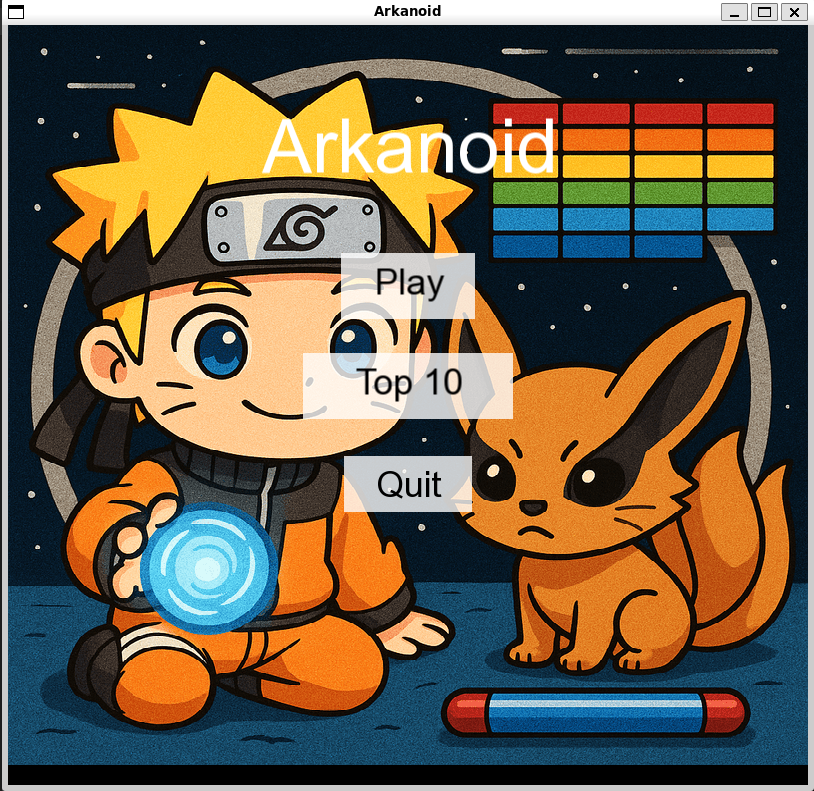
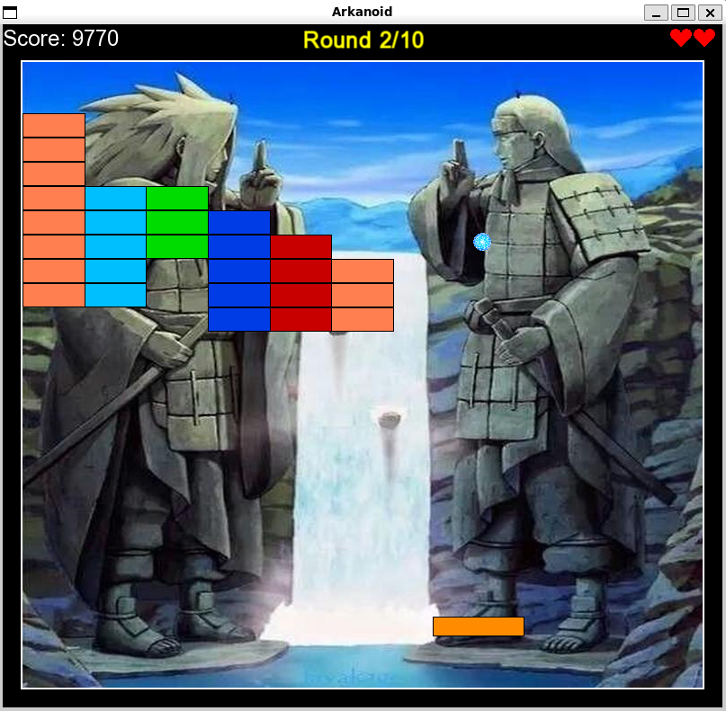

# Arkanoid (Naruto Theme 🍥🦊) — C++ / SFML

An Arkanoid-style game implemented in modern C++ (C++17) using SFML, with a Naruto-inspired visual/audio theme.
The project demonstrates a clean game architecture, real-time loop handling, collision logic, and scene-based flow.

## Scenes
- **Opening** – entry screen
- **Game** – gameplay (score + lives UI, win/lose handling)
- **Top10** – high-score table screen

## Gameplay rules
- The game includes **10 levels**.
- Levels are built from a **JSON configuration file** (level layout and settings are loaded from `tests/arkanoid/game/levels.dat`). 
- You start each level with **3 lives**.
- **Score is cumulative**: total score is the sum across all completed levels until you **win** (finish all levels) or **lose**.

## Controls
- **Left / Right (← / →)**: move paddle
- **Space**: launch ball (and pause after launch, if supported in your build)
- **M**: mute/unmute
- **Esc**: quit

## How to run
1. Switch to the `arkanoid` branch:
```bash
git checkout arkanoid
```

2. Navigate to:
```bash
cd tests/arkanoid/game
```

3. Build & run:
```bash
make check
```

Re-run after changes:
```bash
make recheck
```

## Assets
All required assets to run the game are included (sounds, background images, etc.).
The Makefile copies the needed assets into a local `assets/` folder before running.

## Screenshots
Screenshots are available under `docs/screenshots/`.



